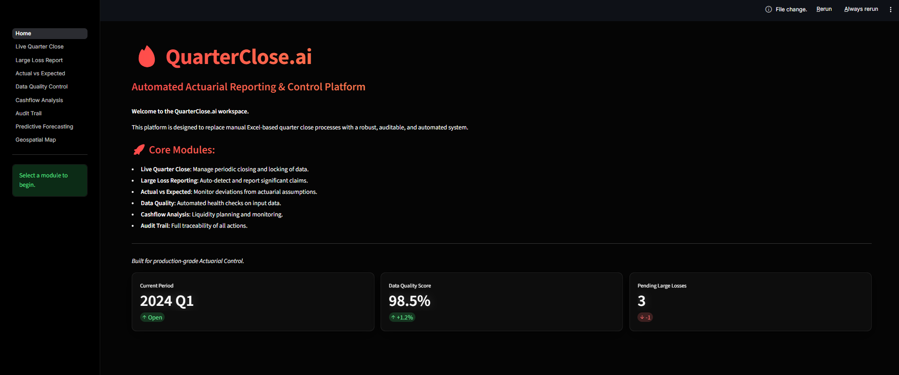
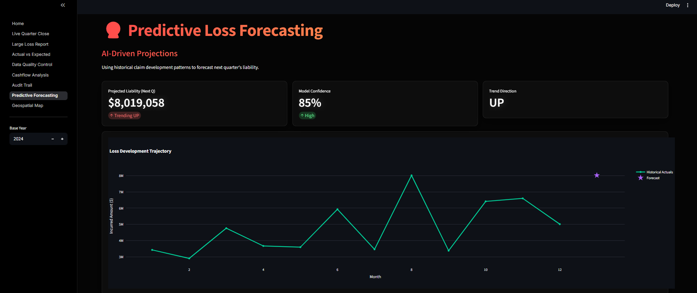
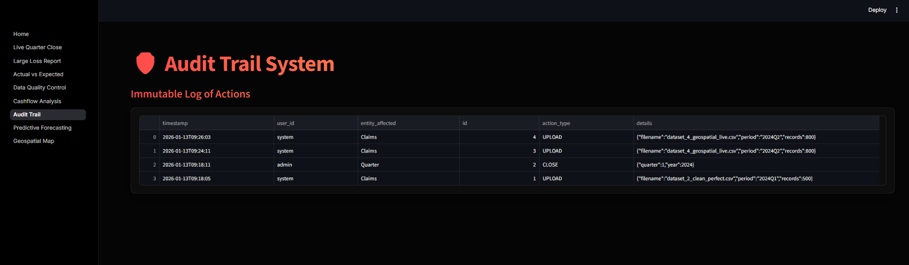

# QuarterClose.ai - Next-Gen Actuarial Platform 🚀

[](https://github.com/viveknair6915/QuarterClose.ai)
[](https://www.python.org/)
[]()

**QuarterClose.ai** is an enterprise-grade Actuarial Reporting & Control Platform designed to replace fragile Excel workflows with a robust, audible, and intelligent system.

> "The rigorous control of a mainframe with the user experience of a modern SaaS."

##  Live Demo

| Component | URL | Status |
|:---|:---|:---:|
| **Frontend UI** | [quarterclose-frontend.onrender.com](https://quarterclose-frontend.onrender.com/) | 🟢 Live |
| **Backend API** | [quarterclose-backend.onrender.com/docs](https://quarterclose-backend.onrender.com/docs) | 🟢 Live |

---

##  Screenshots

> *Please drop screenshots of the application into the `screenshots/` folder.*

| **Live Quarter Close** | **Geospatial Risk Map** |
|:---:|:---:|
|  |  |
| *Secure locking of financial periods.* | *Real-time global claims heatmap.* |

| **Predictive AI** | **Audit Trail** |
|:---:|:---:|
|  |  |
| *Projected liability trends.* | *Immutable SOX-compliant logs.* |

---

##  Key Features

###  Phase 1: Core Controls
- **Live Quarter Close Engine**: A strict workflow to ingest claims and "lock" the quarter, preventing post-close manipulation.
- **Large Loss Detection**: Automated scanning for shock losses (>$100k) with instant reporting.
- **Actual vs Expected (AvE)**: Variance analysis matching real-time claims against actuarial pricing assumptions.
- **Data Quality Firewall**: Blocks uploads with negative incurred amounts, missing segments, or future dates.

###  Phase 2: Advanced Analytics
- ** Geospatial Intelligence**: Interactive 3D map visualizing risk accumulation in major hubs (NY, London, Tokyo).
- ** Predictive Forecasting**: Simple AI models projecting next quarter's liabilities based on historical development patterns.
- ** Premium UI/UX**: "Glassmorphism" design system with dark mode, gradient typography, and fluid animations.

---

##  How to Run

### Option 1: Local Execution (Recommended)
Since Docker configuration can vary by environment, the most reliable way to run the platform is locally.

1.  **Install Dependencies**
    ```bash
    pip install -r requirements.txt
    ```

2.  **Start the Backend (API)**
    Open a terminal and run:
    ```bash
    uvicorn backend.app.main:app --host 0.0.0.0 --port 8000
    ```
    *Access Swagger Docs at: http://localhost:8000/docs*

3.  **Start the Frontend (UI)**
    Open a **second** terminal and run:
    ```bash
    streamlit run frontend/Home.py --server.port 8501
    ```
    *Access App at: http://localhost:8501*

### Option 2: Docker
If you have Docker installed and configured:
```bash
docker-compose up --build
```

---

##  Test Data
The project comes with a built-in synthetic data generator. You can find pre-generated datasets in `data/sample_inputs/`:

- `dataset_1_standard.csv`: Realistic mix of claims (use this for general testing).
- `dataset_4_geospatial_live.csv`: **Best for Maps** - contains rich location tags for global hubs.
- `dataset_3_shock_losses.csv`: **Best for Large Loss** - contains high severity claims.

##  Audit & Compliance
Every action taken in the platform—uploading data, closing a quarter, forcing an override—is logged in the `audit_logs` table. This provides a complete chain of custody for internal and external auditors.

---